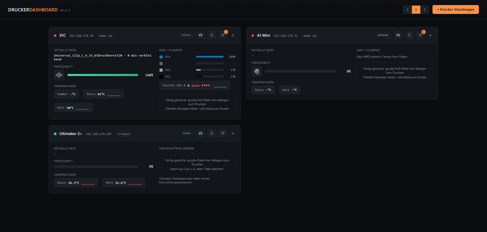

# Drucker Dashboard (MK6)



Lokales Web-Dashboard fuer 3D-/Resin-Drucker im eigenen Netzwerk. Ein
Python-Skript (`app.py`), keine Cloud, kein Account — laeuft als
Konsolen-Skript oder als fertige Windows-/macOS-exe.

| Druckertyp | Anbindung | Live-Status | Kamera | Druck per Drag & Drop |
|---|---|:-:|:-:|:-:|
| **Bambu Lab** (X1/A1/H2/P1/P2/X2) | MQTT/TLS | ✅ | ✅ | ✅ (`.gcode.3mf`, mit AMS-Dialog) |
| **Ultimaker** (UM3, S-Serie, Factor 4) | REST-API | ✅ | ✅ | ✅ (`.gcode`, nach Kopplung) |
| **OctoPrint** | REST-API | ✅ | ✅ | – |
| **Creality** (K1/K1C/K1 Max/K1 SE, Klipper) | Moonraker | ✅ | ✅ | – |
| **Formlabs** (Drucker/Wash L/Cure L) | Local API | ✅ | – | – |

Jeder Drucker bekommt ausserdem automatisch einen **Druckauftrags-
Verlauf** (siehe [Abschnitt 3h](#3h-druckauftrags-verlauf-je-drucker-neu-seit-mk6)).
Bambu Lab und Ultimaker bekommen zusaetzlich eine **Warteschlange**, die
Druckauftraege automatisch aufnimmt, wenn der Drucker gerade beschaeftigt
ist (siehe [Abschnitt 3j](#3j-warteschlange-je-drucker-neu-seit-mk6-v120)).

---

## Inhalt

- [0. Fertige exe per GitHub Actions bauen](#0-automatischer-build-per-github-actions-keine-lokale-installation-noetig)
- [0a. Versionierung](#0a-versionierung)
- [1. Benoetigte Python-Pakete](#1-benoetigte-python-pakete)
- [2. Programm testen (ohne exe)](#2-programm-testen-ohne-exe)
- [3. Eigene exe mit PyInstaller bauen (optional)](#3-umwandlung-in-eine-exe-mit-pyinstaller-lokal-optional)
- [3a. Formlabs hinzufuegen](#3a-formlabs-geraete-hinzufuegen-drucker-wash-l-cure-l)
- [3b. OctoPrint hinzufuegen](#3b-octoprint-drucker-hinzufuegen)
- [3d. Creality hinzufuegen](#3d-creality-drucker-hinzufuegen-k1--k1c--k1-max--k1-se--sonstige-klipper-modelle)
- [3f. Ultimaker hinzufuegen + Drag & Drop](#3f-ultimaker-drucker-hinzufuegen-um3-s-serie-factor-4)
- [3g. Eigene Sensoren & Schaltflaechen](#3g-eigene-sensoren--schaltflaechen-per-zweitem-mqtt-broker)
- [3h. Druckauftrags-Verlauf (neu seit MK6)](#3h-druckauftrags-verlauf-je-drucker-neu-seit-mk6)
- [3i. Kartenlayout: 1/2/3-spaltig (neu seit MK6 v1.1.0)](#3i-kartenlayout-123-spaltig-neu-seit-mk6-v110)
- [3j. Warteschlange je Drucker (neu seit MK6 v1.2.0)](#3j-warteschlange-je-drucker-neu-seit-mk6-v120)
- [3k. Temperatur-Verlaufsdiagramme & Druckbild (neu seit MK6 v2.2.0)](#3k-temperatur-verlaufsdiagramme--druckbild-neu-seit-mk6-v220)
- [4. Bambu Lab: Voraussetzungen](#4-voraussetzungen-auf-seite-der-bambu-lab-drucker)
- [4a. Bambu Lab: Drag & Drop drucken](#4a-bambu-lab-druckauftrag-per-drag--drop-senden)
- [5. Funktionsumfang](#5-funktionsumfang)
- [6. Hinweise / Grenzen](#6-hinweise--grenzen)

---

## 0. Automatischer Build per GitHub Actions (keine lokale Installation noetig)

`.github/workflows/build-exe.yml` baut bei jedem Push automatisch zwei
Zip-Pakete: `DruckerDashboard-v<Version>-windows.zip` und
`-macos-arm64.zip` (nativer Apple-Silicon-Runner, kein Cross-Compiling).

**Jedes Zip enthaelt zwei Dateien, die im selben Ordner bleiben muessen:**
`DruckerDashboard.exe` (Hauptprogramm) + `FtpsUploadHelper.exe`
(separates Hilfsprogramm nur fuer den Bambu-Datei-Upload, siehe
[Abschnitt 4a](#4a-bambu-lab-druckauftrag-per-drag--drop-senden)).

**So geht's:**
1. Neues (leeres) Repository auf GitHub anlegen.
2. Diesen Ordner **inkl. `.github/`** pushen:
   ```bash
   git init
   git add .
   git commit -m "Initial commit"
   git branch -M main
   git remote add origin https://github.com/<dein-user>/<dein-repo>.git
   git push -u origin main
   ```
3. Tab **Actions** → Workflow "Build" laeuft automatisch.
4. Nach ca. 2-4 Minuten: fertige Zips unter **Artifacts** herunterladen.
5. Entpacken (**beide Dateien im selben Ordner lassen**) → `DruckerDashboard.exe` starten.

**Release mit Download-Link:** ein Tag im Format `vX.Y.Z` (passend zu
`APP_VERSION`, siehe [0a](#0a-versionierung)) erzeugt zusaetzlich einen
GitHub Release mit beiden Zips:
```bash
git tag v1.0.0
git push origin v1.0.0
```
Keine weiteren Secrets noetig — `GITHUB_TOKEN` liefert GitHub Actions
automatisch.

**macOS/Gatekeeper:** die Binaries sind nicht signiert/notarisiert.
Beim ersten Start: Finder → Rechtsklick → "Oeffnen" → "Trotzdem oeffnen"
(fuer beide Dateien), oder:
```bash
xattr -dr com.apple.quarantine DruckerDashboard
xattr -dr com.apple.quarantine FtpsUploadHelper
```

## 0a. Versionierung

`APP_VERSION` ganz oben in `app.py` ist die einzige Quelle der Wahrheit
(`MAJOR.MINOR.PATCH`) — wird von GitHub Actions fuer Datei-/Artifact-
Namen genutzt und im Dashboard oben rechts angezeigt (`GET /api/version`).

| Erhoehung | Wann |
|---|---|
| **PATCH** (1.1.0 → 1.1.1) | Bugfix, keine neuen Features |
| **MINOR** (1.1.0 → 1.2.0) | neues Feature, additiv |
| **MAJOR** (1.1.0 → 2.0.0) | Breaking Change (z. B. `config.json` nicht mehr abwaertskompatibel) |

Ablauf: `APP_VERSION` anpassen → committen → Tag setzen (siehe
[Abschnitt 0](#0-automatischer-build-per-github-actions-keine-lokale-installation-noetig)) — Tag und `APP_VERSION` sollten uebereinstimmen.

> **MK6:** eigenstaendig versioniertes Nachfolgeprojekt von MK5 (v1.6.8),
> Versionszaehlung startet daher bewusst neu bei **v1.0.0**. Technisch
> ein rein additiver Fortsatz, kein Rewrite — Details und die komplette
> MK5-Historie in `UEBERGABE.md`, Abschnitt 9.

## 1. Benoetigte Python-Pakete

| Paket | Zweck |
|---|---|
| `flask` | Web-Server / Dashboard im Browser |
| `paho-mqtt` | MQTT-Client fuer Bambu Lab Drucker (bewusst auf **1.6.1** gepinnt — 2.x hat eine andere Callback-Signatur) |
| `pyinstaller` | Wandelt das Skript in eine `.exe` um |

```bash
python -m venv venv
venv\Scripts\activate        # unter Windows
pip install -r requirements.txt
```
oder einzeln: `pip install flask==3.0.3 paho-mqtt==1.6.1 pyinstaller==6.10.0`

## 2. Programm testen (ohne exe)

```bash
python app.py
```
Dashboard danach erreichbar unter `http://<IP-des-PCs>:8000` (IP z. B.
per `ipconfig` unter "IPv4-Adresse" ermitteln).

## 3. Umwandlung in eine .exe mit PyInstaller (lokal, optional)

> Build lieber automatisch? → [Abschnitt 0](#0-automatischer-build-per-github-actions-keine-lokale-installation-noetig).
> Dieser Weg ist nur fuer einen lokalen Build gedacht.

Im Projektordner ausfuehren:
```bash
pyinstaller --onefile --name DruckerDashboard --console app.py
pyinstaller --onefile --name FtpsUploadHelper --console ftps_upload_helper.py
```
Ergebnis: `dist/DruckerDashboard.exe` + `dist/FtpsUploadHelper.exe` —
**beide werden zum Weitergeben benoetigt.**

- `--onefile`: eine einzelne, portable Datei.
- `--console` zeigt ein Log-/URL-Fenster; bei `DruckerDashboard.exe`
  statt dessen `--windowed` moeglich fuer unsichtbaren Hintergrundbetrieb.
  `FtpsUploadHelper.exe` sollte bei `--console` bleiben (unschaedlich,
  laeuft nur intern und kurz).
- Kein `--add-data` noetig — HTML/CSS/JS steckt direkt im Python-Code.
- `config.json` wird beim ersten Start automatisch neben der exe
  angelegt und kann danach mit einem Texteditor angepasst werden.

Ordnerstruktur nach dem Build:
```
DruckerDashboard.exe
FtpsUploadHelper.exe   (WICHTIG: im selben Ordner!)
config.json            (entsteht automatisch beim ersten Start)
```

**Auf einem Mac** funktioniert derselbe Befehl unveraendert (nativ auf
Apple Silicon, kein Rosetta) — Ergebnis ohne Dateiendung, siehe
[Abschnitt 0](#0-automatischer-build-per-github-actions-keine-lokale-installation-noetig) fuer den Gatekeeper-Hinweis.

## 3a. Formlabs-Geraete hinzufuegen (Drucker, Wash L, Cure L)

Typ **Formlabs (Drucker)**, **Formlabs Wash L** oder **Formlabs Cure L**
waehlen — es werden nur **Name** und **IP-Adresse** abgefragt.

Angezeigt: Fortschritt + aktueller Auftrag, bei Druckern zusaetzlich das
geladene Harz/Material; bei Wash L/Cure L der aktuelle Wasch-/Haertezyklus.

> ⚠️ **Voraussetzung:** Formlabs hat keine direkt unter der Geraete-IP
> erreichbare Status-API. Noetig ist die offizielle **"Formlabs Local
> API"** — dafuer muss auf einem PC im selben Netz (z. B. dem Dashboard-
> PC) **PreFormServer** (Teil von PreForm) laufen:
> ```bash
> PreFormServer.exe --port 44388
> ```
> Adresse konfigurierbar ueber `preform_server` in `config.json`. Laeuft
> kein PreFormServer, zeigt die Karte einen roten Hinweis statt Daten.

Die Original-Geraete **"Form Wash"/"Form Cure" ohne "L"** haben laut
Formlabs keine Netzwerkfunktion und koennen nicht eingebunden werden.

Das JSON-Format der Geraeteantwort variiert je nach Firmware —
`FormlabsLocalApiConnection` in `app.py` sucht daher defensiv nach den
gaengigsten Feldnamen. Fehlen Werte, koennen die Konstanten
`FL_PROGRESS_KEYS`/`FL_FILE_KEYS`/`FL_MATERIAL_KEYS`/`FL_STATE_KEYS`
ergaenzt werden (Feldnamen z. B. per `curl http://localhost:44388/devices/`
herausfinden).

## 3b. OctoPrint-Drucker hinzufuegen

Typ **OctoPrint** waehlen. Benoetigt:
- **IP-Adresse** des Geraets, auf dem OctoPrint laeuft
- **API-Key** (OctoPrint → Einstellungen → API)
- optional: Port (Standard 80), HTTPS, eigene Webcam-URL

Wird wie ein Bambu-Lab-Drucker dargestellt (Fortschritt, Datei, Duesen-/
Betttemperatur, Kamera-Icon). Kamera-Standardpfad:
`http://<IP>:8080/webcam/?action=stream` (bei Abweichung Webcam-URL
manuell setzen). Keine Kammertemperatur/kein AMS — normal bei OctoPrint.

## 3d. Creality-Drucker hinzufuegen (K1 / K1C / K1 Max / K1 SE / sonstige Klipper-Modelle)

Passende Version waehlen — **K1 / K1C / K1 Max / K1 SE / sonstiger
Klipper-Drucker** dienen nur der Beschriftung, technisch identisch
(offizielle **Moonraker-API**, das Backend hinter Fluidd/Mainsail).

> ⚠️ **Voraussetzung:** werkseitige K1/K1C/K1 Max/K1 SE haben Moonraker
> **nicht vorinstalliert** — Drucker muss per SSH "gerootet" und
> Moonraker nachinstalliert werden, z. B. per
> [Creality-Helper-Script](https://github.com/Guilouz/Creality-Helper-Script-Wiki).
> Bei einem Klipper-Umbau (Sonic Pad o. ae.) meist schon vorhanden.

Benoetigt: **IP-Adresse**, **Moonraker-Port** (Standard `7125`),
optional **API-Key** (bei Standard-Setups meist unnoetig — Moonraker
vertraut LAN-IPs ueblicherweise via `trusted_clients`), optional
**Webcam-URL** (Standard: Crowsnest unter `http://<IP>/webcam/?action=stream`).

Angezeigt: Fortschritt, Datei, Duesen-/Betttemperatur, Kammertemperatur
nur falls im Klipper-Setup konfiguriert (z. B. K1 Max). Kein AMS-Aequivalent.

**Nicht unterstuetzt:** Modelle mit reinem "Creality OS" ohne Klipper
(z. B. Ender-3 V3 SE) — dafuer gibt es keine dokumentierte lokale API.

## 3f. Ultimaker-Drucker hinzufuegen (UM3, S-Serie, Factor 4)

Typ **Ultimaker** waehlen — nur **Name** und **IP-Adresse** noetig.
Netzwerkfaehige Ultimaker (UM3, S3, S5, S7, Factor 4) bieten eine
offizielle lokale REST-API (`http://<Drucker-IP>/api/v1/`, Swagger unter
`/docs/api/`) — fuer reine Status-Abfragen ohne Login/Key.

Angezeigt: Fortschritt, Datei + Restzeit, Duesen-/Betttemperatur, Kamera
(Standard `http://<IP>:8080/?action=stream`, ueberschreibbar). Keine
Kammertemperatur (Desktopmodelle haben keinen Sensor).

### Druckauftrag per Drag & Drop senden

Eine fertig gesclicte **`.gcode`-Datei** (Cura-Export, lokal als Datei
speichern — nicht "An Netzwerkdrucker senden") auf die Karte ziehen.

**Einmalige Kopplung erforderlich** (vergleichbar mit Bluetooth-Pairing —
Ultimaker verlangt fuer schreibende Aktionen mehr als Bambu Lab):
1. Button **"Jetzt koppeln"** klicken.
2. **Am Drucker-Display bestaetigen** (Anwendungsname "DruckerDashboard").
3. Dashboard fragt automatisch bis zu 2 Minuten den Status ab.
4. Nach Erfolg: Zugangsdaten werden dauerhaft in `config.json`
   gespeichert — Kopplung nur einmal pro Drucker noetig.

Technisch: HTTP **Digest-Authentifizierung** (RFC 2617) gegen
`POST /api/v1/print_job`, Challenge direkt vom Ziel-Endpunkt geholt
(funktioniert auch mit vereinfachten Nachbauten der Ultimaker-API).
Authentifizierung wird automatisch **nur verwendet, wenn der Drucker sie
verlangt** — manche Nachbauten brauchen gar keine. Druckstart erfolgt
sofort nach dem Upload (kein AMS-Aequivalent bei Ultimaker); waehrend
des Uploads erscheint nur ein "wird hochgeladen"-Status ohne
Prozentanzeige (die API bietet keinen Zwischenstand, Dateien sind aber
i. d. R. klein).

> **Bekannte Einschraenkung:** in seltenen Faellen (insbesondere
> Firmware 8.1 vor einem Patch) kann die Kopplungsanfrage fehlschlagen —
> meist hilft ein Firmware-Update.

## 3g. Eigene Sensoren & Schaltflaechen per zweitem MQTT-Broker

Ueber einen **zweiten, von den Druckern unabhaengigen MQTT-Broker**
(z. B. Home Assistant/Mosquitto) lassen sich Sensoren und Ein/Aus-
Schalter an eine Karte anhaengen — z. B. Steckdosen-Leistung oder
Werkstattlicht. Aktuell nur ueber `config.json` konfigurierbar:

**1. Broker global aktivieren:**
```json
"extras_mqtt": {
    "enabled": true, "host": "192.168.1.5", "port": 1883,
    "username": "", "password": "", "tls": false
}
```

**2. Sensoren/Schalter je Drucker in dessen `"extras"`-Liste:**
```json
"extras": [
    { "id": "steckdose1", "label": "Steckdose (Watt)", "kind": "sensor",
      "topic": "home/printer1/power", "unit": "W" },
    { "id": "licht1", "label": "Werkstattlicht", "kind": "switch",
      "command_topic": "home/printer1/light/set",
      "payload_on": "ON", "payload_off": "OFF" }
]
```
- `sensor`: abonniert `topic`, zeigt den letzten Wert (+ optional `unit`).
- `switch`: zwei Buttons ("Ein"/"Aus"), senden `payload_on`/`payload_off`
  auf `command_topic` — ohne Rueckmeldung (Fire-and-forget).
- `id` muss je Drucker eindeutig sein.

Nach dem Speichern der `config.json`: Dashboard/exe neu starten.

## 3h. Druckauftrags-Verlauf je Drucker (neu seit MK6)

Fuer **jeden** angelegten Drucker wird automatisch ein Ordner neben der
exe (bzw. neben `app.py` im Entwicklungsbetrieb) angelegt:
```
print_history/<drucker-id>/
```

Bei jedem erfolgreich gesendeten Druckauftrag (aktuell **Bambu Lab** und
**Ultimaker**, siehe [3f](#3f-ultimaker-drucker-hinzufuegen-um3-s-serie-factor-4)
und [4a](#4a-bambu-lab-druckauftrag-per-drag--drop-senden)) landet dort
eine Kopie der Datei mit Zeitstempel und — falls extrahierbar — einem
Vorschaubild. Automatisch begrenzt auf die **letzten 30 Auftraege je
Drucker**, aeltere werden beim naechsten Druck entfernt.

Aufrufbar ueber das **Uhr-Symbol** im Kopf jeder Drucker-Karte. Pro
Eintrag: Dateiname, Datum/Uhrzeit, Vorschaubild (falls vorhanden), plus:

| Aktion | Wirkung |
|---|---|
| **Erneut drucken** | sendet dieselbe Datei erneut; bei Bambu erscheint wieder der AMS-Zuordnungsdialog (Fach-Bestueckung kann sich geaendert haben). Ist der Drucker gerade beschaeftigt, wird stattdessen automatisch in seine Warteschlange gelegt (siehe [3j](#3j-warteschlange-je-drucker-neu-seit-mk6-v120)) |
| **In Warteschlange** *(neu seit v1.2.0)* | legt diesen Eintrag in die eigene Warteschlange des Druckers, ohne ihn sofort zu senden |
| **Zuweisen** *(neu seit v1.2.0)* | kopiert diesen Eintrag in die Warteschlange eines **anderen** Druckers im Dashboard |
| **Loeschen** | entfernt Eintrag + Datei + Vorschaubild dauerhaft (Drucker selbst unberuehrt) |

> ⚠️ **Kein doppelter Verlaufseintrag (seit v1.2.0):** wird ein Verlaufs-
> eintrag erneut an DENSELBEN Drucker gesendet (direkt oder ueber die
> Warteschlange), wird nur sein Zeitstempel aktualisiert und er nach oben
> verschoben — es entsteht KEIN zweiter Eintrag fuer dieselbe Datei. Wird
> er dagegen einem **anderen** Drucker zugewiesen, bekommt dessen Verlauf
> nach dem Druck einen eigenen, neuen Eintrag (dort wurde schliesslich
> tatsaechlich gedruckt).

**Vorschaubilder:** bei Bambu (`.gcode.3mf`) wird das von Bambu Studio/
OrcaSlicer eingebettete Plate-Vorschaubild gelesen. Bei Ultimaker
(`.gcode`) wird **bewusst kein** Bild extrahiert — dafuer gibt es kein
ueber alle Cura-Versionen zuverlaessig dokumentiertes Format; solche
Eintraege zeigen ein generisches Datei-Symbol, das ist kein Fehler.

**Sortierung:** Standardmaessig neueste zuerst. Ueber die Schaltflaeche
oberhalb der Liste laesst sich *(neu seit v1.2.0)* auf alphabetische
Sortierung nach Dateiname umschalten (rein clientseitig, ohne erneuten
Datenabruf).

Wird ein Drucker entfernt, bleibt sein Verlaufsordner bewusst erhalten
(kein automatisches Aufraeumen) — bei Bedarf manuell aus `print_history/`
loeschen.

## 3i. Kartenlayout: 1/2/3-spaltig (neu seit MK6 v1.1.0)

Oben rechts im Kopfbereich schaltet eine kleine Schaltflaechen-Gruppe
(**1 / 2 / 3**) zwischen drei Ansichten der Drucker-Kacheln um:

| Modus | Wirkung |
|---|---|
| **1** (Standard, wie bisher) | Kacheln untereinander in einer Spalte |
| **2** | Kacheln in einem Raster zu je 2 pro Zeile |
| **3** | Kacheln in einem Raster zu je 3 pro Zeile |

Die Auswahl wird **im Browser gespeichert** (`localStorage`) — sie ist
eine reine Anzeige-Praeferenz je Geraet/Browser, keine Einstellung in
`config.json`. Auf einem anderen Rechner oder in einem anderen Browser
startet die Ansicht wieder mit **1**.

Bei geringer Fensterbreite (z. B. Laptop-Bildschirm oder verkleinertes
Fenster) reduziert das Dashboard die Spaltenzahl automatisch, damit die
Kacheln nicht zu schmal werden — die interne Aufteilung jeder Karte
(Status links, Steuerung rechts) faellt in diesem Fall ebenfalls auf
eine Spalte zurueck. Das passiert unabhaengig davon, ob die Kacheln
wegen des Fensters oder wegen des gewaehlten 3-Spalten-Modus schmal
werden.

## 3j. Warteschlange je Drucker (neu seit MK6 v1.2.0)

Wird eine Druckdatei per Drag & Drop auf einen Drucker gezogen, **waehrend
dieser bereits druckt (oder pausiert)**, wird sie NICHT sofort gesendet
(kein AMS-Dialog, kein sofortiger Ultimaker-Druck), sondern automatisch in
die **Warteschlange** dieses Druckers gelegt. Aufrufbar ueber das neue
**Listen-Symbol** im Kopf jeder Bambu-/Ultimaker-Karte (mit Zaehl-Badge,
sobald die Warteschlange nicht leer ist) — fuer OctoPrint/Creality/
Formlabs gibt es keine Warteschlange, da diese Druckertypen keinen
Druckversand per Dashboard-Upload unterstuetzen.

**Reihenfolge:** der AELTESTE (=naechste) Auftrag steht **oben** — bewusst
umgekehrt zum Verlauf, wo der NEUESTE oben steht (siehe [3h](#3h-druckauftrags-verlauf-je-drucker-neu-seit-mk6)).

| Aktion | Wirkung |
|---|---|
| **▲ / ▼** | verschiebt einen Eintrag in der Warteschlange nach oben/unten |
| **Zuweisen** | verschiebt den Eintrag in die Warteschlange eines **anderen** Druckers im Dashboard |
| **Loeschen** | entfernt den Eintrag dauerhaft (Schaltflaeche/Symbol seit v2.1.0 durchgehend rot hinterlegt) |
| **+ Datei hinzufuegen** | legt eine weitere Datei manuell in die Warteschlange — unabhaengig davon, ob der Drucker gerade beschaeftigt ist (fuer vorausschauendes Planen mehrerer Auftraege). Seit v2.1.0 kann die Datei alternativ auch per **Drag & Drop** auf die Drop-Zone im Warteschlangen-Fenster gezogen werden, genau wie auf die Drucker-Kachel selbst |
| **Druckraum leer — naechsten senden** | sendet den obersten (aeltesten) Auftrag an den Drucker |

**"Druckraum leer — naechsten senden":** gedacht zum Klicken, NACHDEM der
laufende Druck fertig ist und das gedruckte Teil entnommen wurde. Bei
Bambu erscheint danach ganz normal der AMS-Zuordnungsdialog (die
Fach-Bestueckung kann sich seit dem Einreihen geaendert haben), bei
Ultimaker startet der Druck sofort. Der Warteschlangen-Eintrag wird erst
entfernt, wenn der Auftrag tatsaechlich erfolgreich gesendet wurde — ein
Abbruch im AMS-Dialog oder ein Sendefehler verliert ihn also nicht, "Druckraum
leer" kann dann einfach erneut geklickt werden.

> ⚠️ **Bei Bambu Lab (seit v2.0.1) ist die Schaltflaeche erst klickbar,
> wenn der Drucker WIRKLICH fertig ist** — der Status muss `FINISH`
> (Druck soeben abgeschlossen), `IDLE` (Drucker hat noch gar nichts
> gedruckt) oder `FAILED` (Druck abgebrochen/fehlgeschlagen — seit
> v2.1.1) sein. Solange der Drucker noch druckt, pausiert oder sich in
> einem Uebergangszustand befindet (z. B. `PREPARE`/`SLICING`), bleibt der
> Knopf ausgegraut und ein Hinweistext zeigt den aktuellen Status an —
> das Dashboard aktualisiert das automatisch alle 2,5 Sekunden, ohne dass
> das Fenster neu geoeffnet werden muss. Diese Pruefung erfolgt zusaetzlich
> serverseitig, ein Klick auf einen deaktivierten Knopf kann den
> Druckauftrag also nicht versehentlich vorzeitig auf den Drucker
> schicken. Fuer Ultimaker gilt weiterhin die einfachere Regel "Drucker
> ist nicht beschaeftigt".
>
> **Bugfix v2.1.1:** vorher blieb die Warteschlange nach einem
> fehlgeschlagenen Druck dauerhaft blockiert, da der Drucker in diesem
> Fall im Status `FAILED` verharrt (weder `FINISH` noch `IDLE`) — der
> Knopf liess sich dann gar nicht mehr klicken, bis ausserhalb der
> Warteschlange ein neuer Druck gestartet wurde. `FAILED` zaehlt jetzt
> ebenfalls als "bereit fuer den naechsten Druck".

**Auftraege aus dem Verlauf hinzufuegen/zuweisen:** im Verlauf
([3h](#3h-druckauftrags-verlauf-je-drucker-neu-seit-mk6)) legen die
Schaltflaechen "In Warteschlange" bzw. "Zuweisen" einen bestehenden
Verlaufseintrag zusaetzlich in eine Warteschlange, ohne den Verlaufs-
eintrag selbst zu entfernen.

Wird ein bereits im Verlauf vorhandener Auftrag ueber die Warteschlange
tatsaechlich (erneut) gesendet, entsteht dabei **kein doppelter
Verlaufseintrag** (siehe Hinweis in [3h](#3h-druckauftrags-verlauf-je-drucker-neu-seit-mk6))
— ausser er wird einem anderen Drucker zugewiesen, dort ist ein neuer
Eintrag korrekt.

> ⚠️ **Zuweisen an einen anderen Drucker (seit v2.1.0 eingeschraenkt):**
> ein Verlaufs- oder Warteschlangen-Eintrag laesst sich nur einem Drucker
> **desselben Typs** zuweisen (Bambu Lab → Bambu Lab, Ultimaker →
> Ultimaker). Bei Bambu Lab zusaetzlich nur einem Drucker **derselben
> Druckerfamilie** (siehe [4](#4-voraussetzungen-auf-seite-der-bambu-lab-drucker)),
> also z. B. nur A1 untereinander oder nur X1 untereinander — ein fuer
> eine X1 vorbereiteter Auftrag (Slicing/AMS-Zuordnung) passt nicht ohne
> Weiteres auf eine A1. Die Auswahlliste im "Zuweisen"-Dialog zeigt von
> vornherein nur passende Drucker an; die Pruefung erfolgt zusaetzlich
> serverseitig.

## 3k. Temperatur-Verlaufsdiagramme & Druckbild (neu seit MK6 v2.2.0)

**Kleines Verlaufsdiagramm je Temperaturanzeige:** jeder Temperatur-Chip
(Duese/Bett/Kammer, ueberall dort wo Temperaturen angezeigt werden) zeigt
zusaetzlich eine kleine Sparkline mit dem Verlauf der letzten Werte —
seit v2.2.1 als **rote Linie**. Diese wird rein im Browser aus den
ohnehin alle 2,5 Sekunden abgerufenen Status-Werten aufgebaut — es gibt
keine dauerhafte, serverseitig gespeicherte Temperaturhistorie, und der
Verlauf geht beim Neuladen der Seite verloren (bewusst, siehe
[6](#6-hinweise--grenzen): das Dashboard speichert grundsaetzlich keine
Zeitreihen).

**AMS-Luftfeuchtigkeit (neu seit v2.2.1):** je AMS-Einheit (nicht je
Fach) wird zusaetzlich die vom AMS gemeldete Luftfeuchtigkeits-**Stufe**
angezeigt (1 = trocken bis 5 = feucht — ein von Bambu Lab selbst
definierter Indexwert, **kein Prozentwert**), ebenfalls mit
Verlaufsdiagramm — seit v2.2.2 als **blaue Linie** (Temperaturen bleiben
rot, damit beide auf einen Blick unterscheidbar sind). Erscheint nur fuer
AMS-Einheiten, die dieses Feld tatsaechlich melden — bei mehreren
angeschlossenen AMS-Einheiten wird jede einzeln aufgefuehrt ("Feuchte AMS
0", "Feuchte AMS 1", ...).

**Massstab zur Einordnung (neu seit v2.2.2, um ein Wort-Label erweitert
seit v2.2.3):** direkt neben dem Feuchte-Rohwert steht jetzt zusaetzlich
ein sichtbares Wort ("trocken", "leicht feucht", "mittel", "feucht",
"sehr feucht") sowie eine kleine Punktreihe (1 bis 5, gefuellt bis zur
aktuellen Stufe) — beide in Ampelfarbe (gruen = trocken/gut, gelb =
mittel, rot = feucht/schlecht), damit auf einen Blick erkennbar ist, ob
der aktuelle Wert unproblematisch ist oder ein Wechsel des Trockenmittels
sinnvoll waere. Ein Mauszeiger auf der Punktreihe nennt zusaetzlich die
Bedeutung der Skala in Worten ("1 = trocken/gut, 5 = feucht/schlecht").

**Keine Kammertemperatur bei der A1-Familie:** die A1-Serie (A1, A1 Mini)
hat keinen Kammertemperatursensor. Der entsprechende Chip wird deshalb bei
Druckern mit Druckerfamilie "A1-Serie" (siehe
[4](#4-voraussetzungen-auf-seite-der-bambu-lab-drucker)) generell nicht
mehr angezeigt, statt dauerhaft `-°C` zu zeigen.

**Druckbild neben dem Fortschrittsbalken:** zeigt das Vorschaubild des
zuletzt ueber das Dashboard gesendeten Druckauftrags (Bambu Lab/
Ultimaker) — dieselbe Vorschau wie im Verlauf
([3h](#3h-druckauftrags-verlauf-je-drucker-neu-seit-mk6)). Erscheint
nicht, solange fuer diesen Drucker noch kein Auftrag ueber das Dashboard
gesendet wurde (z. B. frisch angelegter Drucker, oder OctoPrint/Creality/
Formlabs — dort ist kein Druckversand ueber das Dashboard moeglich).

## 4. Voraussetzungen auf Seite der Bambu Lab Drucker

1. Am Drucker: Einstellungen → WLAN → **LAN-Modus** aktivieren.
2. Angezeigten 8-stelligen **Access Code** notieren.
3. **Seriennummer** vom Typenschild bzw. Einstellungen → Geraeteinformationen.
4. **IP-Adresse** im WLAN-Menue des Druckers oder im Router ablesen.

Das Formular fragt fuenf Felder ab: **Name, IP-Adresse, Access Code,
Seriennummer, Druckerfamilie**.

**Druckerfamilie:** X1-Serie (X1C, X1E), A1-Serie (A1, A1 Mini),
H2-Serie (H2S/H2D/H2D Pro/H2C), P1-Serie (P1P/P1S), P2-Serie (P2S),
X2-Serie (X2D). Bestimmt nur, welche Verbindungseinstellung der
Datei-Upload ([4a](#4a-bambu-lab-druckauftrag-per-drag--drop-senden))
beim ersten Versuch nutzt — **eine falsche Auswahl verhindert den Druck
nicht**, das Dashboard probiert bei einem Fehlschlag automatisch die
andere Einstellung. Voreingestellt: X1-Serie. Fuer H2/P1/P2/X2 liegen
noch keine eigenen Erkenntnisse vor, sie nutzen vorlaeufig dieselbe
Einstellung wie X1 (siehe `BAMBU_FAMILY_TO_FTPS_PROFILE` in `app.py`).

**Fuer die Druckfunktion zusaetzlich noetig:** **Developer Mode**
separat aktivieren (Bambu Handy App → Drucker → Einstellungen →
"Developer Mode") — **pro Geraet**, nicht global. Ohne ihn lehnt
neuere Firmware den Druckstart per MQTT ab (Status/Kamera funktionieren
trotzdem). Fehlermeldung am Drucker in diesem Fall: **"Die Ueberpruefung
des MQTT-Befehls ist fehlgeschlagen"** — kein Dashboard-Fehler, sondern
Bambus eigener Hinweis auf den fehlenden Developer Mode.

## 4a. Bambu Lab: Druckauftrag per Drag & Drop senden

Jede Bambu-Karte hat unter der AMS-Anzeige ein Ablage-Feld. Unterstuetzt
werden **ausschliesslich fertig gesclicte `.gcode.3mf`-Dateien**
(Export aus Bambu Studio/OrcaSlicer) — keine rohen `.gcode`/`.3mf`-
Dateien, da sich diese laut Community-Quellen nicht zuverlaessig per
MQTT starten lassen. **Developer Mode muss aktiv sein** (siehe
[Abschnitt 4](#4-voraussetzungen-auf-seite-der-bambu-lab-drucker)).

**Ablauf in zwei Schritten:**

1. **Vorschau/Zuordnung pruefen** — Datei wird zum Dashboard
   hochgeladen (noch NICHT zum Drucker) und ausgewertet. Der Dialog
   "AMS-Zuordnung pruefen" zeigt nur die **tatsaechlich fuer diesen
   Druck benoetigten** Filamente (nicht alle im Projekt konfigurierten).
   Pro Filament:
   - **"Vorschlag aus Datei verwenden"** (voreingestellt) — automatischer
     Farb-/Typ-Match gegen die aktuell im AMS erkannten Faecher, als
     deutsches Farbwort angezeigt (exakter Hex-Wert als Tooltip). Kein
     Match → "Extern / manuell am Display".
   - **"Anderes Material aus dem AMS waehlen"** — Dropdown mit allen
     uebrigen Faechern, fuer bewusst abweichende Materialwahl.
2. **Bestaetigen** — "Drucken starten" laedt per FTPS hoch und startet
   den Druck mit der gewaehlten Zuordnung. Fortschrittsbalken mit
   Prozent + Byte-Anzeige waehrend des Uploads; "Abbrechen" verwirft
   alles, ohne den Drucker zu erreichen. **Schlaegt der Upload fehl,
   bleiben Datei und Zuordnung erhalten** — erneuter Klick auf "Drucken
   starten" versucht es direkt noch einmal.

Ergebnis erscheint als Toast oben rechts, unabhaengig vom sich alle
2,5 s aktualisierenden Karten-Grid.

**Technischer Ablauf:** Upload per **FTPS (Port 990, implizites TLS)**,
danach ein MQTT-Kommando `project_file` mit dem vollstaendigen,
dokumentierten Feldsatz (`bed_type`, `subtask_name`, `flow_cali`, …).

**Filament-/Farbzuordnung — Details:**
- Nur die auf Plate 1 tatsaechlich verwendeten Filamente werden
  angezeigt (Abgleich `project_settings.config` gegen `slice_info.config`
  in der `.gcode.3mf`); ist Letzteres nicht auswertbar, werden
  sicherheitshalber alle konfigurierten Filamente gezeigt.
- Farbabgleich toleriert kleine Abweichungen (z. B. Slicer- vs.
  AMS/RFID-Hexwert derselben Farbe), aber niemals deutlich
  unterschiedliche Farben (z. B. Gruen/Hellgruen) — ein falscher
  automatischer Treffer waere schlechter als der sichere Rueckfall auf
  manuelle Auswahl.
- Verbundwerkstoffe (`PLA-CF`, `PETG-CF`, `ASA-CF`, `ABS-GF`, …) werden
  **nie** mit ihrer unverstaerkten Grundvariante verwechselt, selbst bei
  gleicher Fach-Farbe.

**Geloeste Probleme aus der Entwicklung** (technische Details, Ursache
und Testumfang in `UEBERGABE.md`, Abschnitt "Versionierung" bzw. 5/6):
- Druckstart blieb bei Materialladen haengen (fehlendes `bed_type`-Feld)
- Mehrfarb-Druck startete nicht (`flow_cali`) bzw. AMS-Zuordnung wurde
  abgelehnt ("Failed to get AMS mapping table", Indexierungsfehler)
- X1-Serie (X1C/X1E): FTPS-Datenverbindung brach reproduzierbar ab
  (Ursache: vsftpd verlangt TLS-Session-Wiederverwendung + TLS-1.2-Deckel)
- A1 Mini: Timeout nach vollstaendiger Uebertragung (Ursache: fehlender
  `unwrap()`-Verzicht beim TLS-Verbindungsabschluss)

Beide FTPS-Faelle sind seit v1.6.0/v1.6.1 zuverlaessig geloest — jede
Druckerfamilie nutzt automatisch das passende Verbindungsprofil (siehe
[Abschnitt 4](#4-voraussetzungen-auf-seite-der-bambu-lab-drucker)).
Druckauftraege per Drag & Drop gibt es nur fuer **Bambu Lab** und
**Ultimaker** — OctoPrint/Creality/Formlabs haben eigene etablierte Wege
(OctoPrint-UI, Moonraker/Fluidd/Mainsail).

## 5. Funktionsumfang

| Bereich | Details |
|---|---|
| Drucker verwalten | beliebig viele hinzufuegen/entfernen, als Karten dargestellt |
| Fortschritt | Balken + Prozentzahl (alle Typen) |
| Aktuelle Datei | mit typspezifischer Bezeichnung (z. B. "Aktueller Waschzyklus" bei Wash L) |
| Kamera | Bambu Lab, OctoPrint, Creality, Ultimaker |
| AMS-Anzeige | Bambu Lab: Fuellstand je Fach als Balken (Farbe = Filamentfarbe) + Materialsorte |
| Temperaturen | Duese/Bett bei Bambu/OctoPrint/Creality/Ultimaker; Kammer bei Bambu ausser bei der A1-Familie (kein Kammersensor, seit v2.2.0 generell ausgeblendet), bei Creality falls im Klipper-Setup konfiguriert (bei Ultimaker nicht verfuegbar — kein Sensor); Anzeige seit v2.1.0 immer auf max. 2 Nachkommastellen gerundet; seit v2.2.0 mit kleinem Verlaufsdiagramm je Temperaturanzeige ([3k](#3k-temperatur-verlaufsdiagramme--druckbild-neu-seit-mk6-v220)) |
| Material | Formlabs: aktuell geladenes Harz |
| Restzeit | Bambu Lab, OctoPrint, Ultimaker |
| Fehleranzeige | roter Klartext-Hinweis direkt auf der Karte bei Verbindungsproblemen |
| Sensoren/Schalter | frei definierbar per zweitem MQTT-Broker ([3g](#3g-eigene-sensoren--schaltflaechen-per-zweitem-mqtt-broker)) |
| **Druckauftrags-Verlauf** | **neu seit MK6** — automatischer Ordner je Drucker, Einsehen/Erneut drucken/Loeschen ([3h](#3h-druckauftrags-verlauf-je-drucker-neu-seit-mk6)) |
| **Kartenlayout** | **neu seit MK6 v1.1.0** — wahlweise 1/2/3-spaltig, Auswahl je Browser gespeichert ([3i](#3i-kartenlayout-123-spaltig-neu-seit-mk6-v110)) |
| **Warteschlange** | **neu seit MK6 v1.2.0** — Bambu Lab/Ultimaker: automatisches Einreihen bei beschaeftigtem Drucker, manuell bearbeitbar (Reihenfolge/Loeschen/Hinzufuegen), Zuweisen an andere Drucker ([3j](#3j-warteschlange-je-drucker-neu-seit-mk6-v120)) |
| **Druckbild neben Fortschrittsbalken** | **neu seit MK6 v2.2.0** — Vorschaubild des zuletzt ueber das Dashboard gesendeten Druckauftrags (Bambu Lab/Ultimaker) ([3k](#3k-temperatur-verlaufsdiagramme--druckbild-neu-seit-mk6-v220)) |
| Aktualisierung | automatisch alle 2,5 Sekunden im Browser |

## 6. Hinweise / Grenzen

- **Inoffizielle Protokolle:** die Bambu-Kamera (Port 6000) und der
  Drag-&-Drop-Druckversand (FTPS + MQTT `project_file`) nutzen von der
  Community reverse-engineerte, nicht offiziell dokumentierte Protokolle.
  Ein Bambu-Firmware-Update kann das jederzeit aendern, ohne dass das
  Dashboard selbst fehlerhaft ist. Bambu-MQTT laeuft ausschliesslich
  lokal per TLS (kein Cloud-Account noetig).
- **`FtpsUploadHelper.exe` muss immer neben `DruckerDashboard.exe`
  liegen** — fehlt sie, greift ein Fallback-Mechanismus (Selbstaufruf).
- Waehrend eines Drag-&-Drop-Uploads pausiert Status/Kamera/AMS kurz
  (die MQTT-Verbindung wird bewusst getrennt und danach automatisch neu
  aufgebaut) — das ist beabsichtigt, kein Fehler.
- Die AMS-Zuordnung nutzt die inoffizielle Konvention "4 Faecher pro
  AMS-Einheit" fuer den flachen Index — der Nutzer bestaetigt die
  Zuordnung aber immer im Dialog, bevor etwas gesendet wird.
- Vorbereitete, aber nie bestaetigte Druckauftraege werden nach 20
  Minuten automatisch aufgeraeumt (`DashboardApp.PRINT_JOB_MAX_AGE_SEC`).
- Formlabs braucht zwingend einen laufenden PreFormServer im Netz
  ([3a](#3a-formlabs-geraete-hinzufuegen-drucker-wash-l-cure-l)); Creality
  zwingend eine Moonraker-Instanz auf dem Drucker ([3d](#3d-creality-drucker-hinzufuegen-k1--k1c--k1-max--k1-se--sonstige-klipper-modelle)) — beides
  Einschraenkungen der jeweiligen Hersteller, keine Design-Entscheidung
  dieses Programms. "Creality OS" ohne Klipper wird bewusst nicht
  unterstuetzt (keine dokumentierte lokale API).
- **Bekanntes, noch ungeklaertes Problem (Stand v2.2.0): Kammertemperatur
  bei X1-Serie zeigt weiterhin `-°C`.** Der Server prueft seit v2.2.0
  zusaetzlich zum bekannten Feldnamen `chamber_temper` defensiv auch
  `chamber_temp` (siehe `PrinterConnection._apply_print_report()`) — liegt
  aber trotzdem kein Wert vor, wird das EINMALIG pro Verbindung auf der
  Server-Konsole geloggt (inkl. der tatsaechlich im MQTT-Report
  vorhandenen Schluessel). Betroffene Nutzer: bitte den entsprechenden
  Konsolen-Hinweis nach `[MK6] Hinweis: ... liefert kein 'chamber_temper'/
  'chamber_temp'-Feld ...` melden, damit der tatsaechliche Feldname
  anhand echter Rohdaten (statt Vermutungen) ermittelt werden kann.
- OctoPrint-Kamera nimmt die mjpg-streamer-Standard-URL an, falls keine
  eigene Webcam-URL gesetzt ist.
- Ultimaker braucht keine zusaetzliche Software — die lokale API ist von
  Haus aus aktiv.
- Fuer Zugriff aus dem gesamten LAN ggf. eingehenden TCP-Port `8000` in
  der Firewall freigeben.

---

Fuer Architektur-Details, Codestellen und die vollstaendige
Entwicklungshistorie (inkl. MK5) siehe `UEBERGABE.md`.
