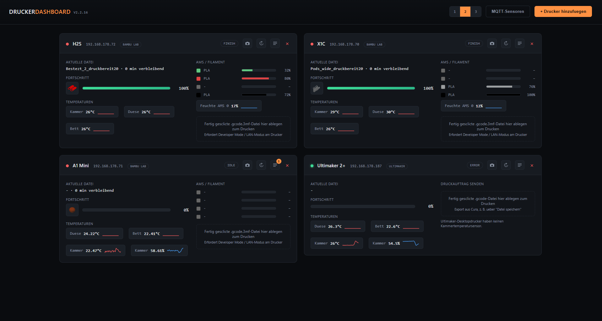

# Drucker Dashboard (MK6)



Lokales Web-Dashboard fuer 3D-/Resin-Drucker im eigenen Netzwerk. Ein
Python-Skript (`app.py`), keine Cloud, kein Account.

| Druckertyp | Anbindung | Kamera | Druck per Drag & Drop |
|---|---|:-:|:-:|
| **Bambu Lab** (X1/A1/H2/P1/P2/X2) | MQTT/TLS | ✅ | ✅ (`.gcode.3mf`, mit AMS-Dialog) |
| **Ultimaker** (UM3, S-Serie, Factor 4) | REST-API | ✅ | ✅ (`.gcode`, nach Kopplung) |
| **OctoPrint** | REST-API | ✅ | – |
| **Creality** (K1/K1C/K1 Max/K1 SE, Klipper) | Moonraker | ✅ | – |
| **Formlabs** (Drucker/Wash L/Cure L) | Local API | – | – |

Jeder Drucker bekommt automatisch einen **Verlauf** (letzte 30
Druckauftraege) sowie Bambu Lab/Ultimaker zusaetzlich eine
**Warteschlange** fuer beschaeftigte Drucker.

> Fuer Architektur, Codestellen und die vollstaendige
> Entwicklungshistorie siehe `UEBERGABE.md`. Diese README beschreibt nur
> den aktuellen Stand (v2.2.19).

---

## Inhalt

- [0. Build & Release per GitHub Actions](#0-build--release-per-github-actions)
- [1. Lokal einrichten/starten](#1-lokal-einrichtenstarten)
- [2. Drucker hinzufuegen](#2-drucker-hinzufuegen)
- [3. Verlauf, Warteschlange & Kartenlayout](#3-verlauf-warteschlange--kartenlayout)
- [4. Bambu Lab: Drag & Drop drucken](#4-bambu-lab-drag--drop-drucken)
- [5. Temperatur/Feuchte/Druckzeit-Anzeigen](#5-temperaturfeuchtedruckzeit-anzeigen)
- [6. Grenzen & Hinweise](#6-grenzen--hinweise)

---

## 0. Build & Release per GitHub Actions

`.github/workflows/build-exe.yml` baut bei **jedem Push** automatisch
Windows- und macOS-arm64-Zips (`DruckerDashboard-v<Version>-...zip`,
je zwei Dateien: `DruckerDashboard.exe` + `FtpsUploadHelper.exe` - **im
selben Ordner halten**) und veroeffentlicht sie automatisch als
**GitHub Release** (benannt nach `APP_VERSION` in `app.py`).

**Setup:**
```bash
git init && git add . && git commit -m "Initial commit"
git branch -M main
git remote add origin https://github.com/<user>/<repo>.git
git push -u origin main
```
Danach: Tab **Actions** abwarten (2-4 Min), fertige Zips unter
**Releases**. Kein manueller Tag noetig, kein zusaetzliches Secret
(`GITHUB_TOKEN` liefert GitHub Actions automatisch). Falls der
Release-Schritt mit `403 Resource not accessible by integration`
fehlschlaegt: unter **Settings → Actions → General → Workflow
permissions** "Read and write permissions" aktivieren (der Workflow
fordert seit v2.2.19 zwar selbst Schreibzugriff an, manche
Organisations-Einstellungen koennen das aber weiterhin einschraenken).

**macOS/Gatekeeper** (Binaries sind unsigniert): Finder → Rechtsklick →
"Oeffnen" → "Trotzdem oeffnen", oder `xattr -dr com.apple.quarantine <Datei>`.

**Versionierung:** `APP_VERSION` in `app.py` (`MAJOR.MINOR.PATCH`) ist
die einzige Quelle der Wahrheit - PATCH = Bugfix, MINOR = neues Feature,
MAJOR = Breaking Change. Einfach anpassen und pushen, der Rest ist
automatisch.

## 1. Lokal einrichten/starten

```bash
python -m venv venv && venv\Scripts\activate   # Windows
pip install -r requirements.txt                # flask, paho-mqtt (1.6.1!), pyinstaller
python app.py                                  # -> http://<IP-des-PCs>:8000
```

**Eigene exe bauen (optional, sonst siehe Abschnitt 0):**
```bash
pyinstaller --onefile --name DruckerDashboard --console app.py
pyinstaller --onefile --name FtpsUploadHelper --console ftps_upload_helper.py
```
Beide `dist/*.exe` werden zum Weitergeben benoetigt (gleicher Ordner).
`config.json` entsteht automatisch beim ersten Start. Funktioniert
identisch auf Apple Silicon (kein Rosetta, kein `--add-data` noetig).

## 2. Drucker hinzufuegen

| Typ | Benoetigte Angaben | Voraussetzung |
|---|---|---|
| **Bambu Lab** | Name, IP, Access Code, Seriennummer, Druckerfamilie | LAN-Modus + **Developer Mode** aktivieren (**lokal am Drucker** ueber dessen Einstellungen, pro Geraet - im reinen LAN-Modus ist die Verbindung zur Bambu-Handy-App gekappt, dort laesst sich der Developer Mode nicht einschalten). H2-Serie/P2S: **USB-Stick muss stecken** (FTPS-Upload erreicht sonst keinen Speicher, Fehler `553 Could not create file`); X1/P1/A1 brauchen dafuer eine microSD. |
| **Ultimaker** | Name, IP | Einmalige Kopplung: "Jetzt koppeln" klicken, am Drucker-Display bestaetigen. |
| **OctoPrint** | IP, API-Key (Einstellungen → API), optional Port/HTTPS/Webcam-URL | - |
| **Creality** (K1/K1C/K1 Max/K1 SE, Klipper) | IP, Moonraker-Port (7125), optional API-Key/Webcam-URL | Moonraker muss installiert sein (werksseitig nicht vorhanden, z. B. per [Creality-Helper-Script](https://github.com/Guilouz/Creality-Helper-Script-Wiki)). "Creality OS" ohne Klipper wird nicht unterstuetzt. |
| **Formlabs** (Drucker/Wash L/Cure L) | Name, IP | Braucht laufenden **PreFormServer** (`PreFormServer.exe --port 44388`) auf einem PC im selben Netz. "Form Wash/Cure" ohne "L" werden nicht unterstuetzt (keine Netzwerkfunktion). |

**Bambu-Druckerfamilie** bestimmt nur, welches FTPS-/Druckstart-Profil
zuerst probiert wird (X1-Serie, A1-Serie, H2-Serie, P1-Serie, P2-Serie,
X2-Serie) - eine falsche Wahl verhindert den Druck nicht zwingend.

**Eigene Sensoren/Schalter** ueber einen zweiten, von den Druckern
unabhaengigen MQTT-Broker (z. B. Home Assistant/Mosquitto) lassen sich
komplett ueber den Button **"MQTT-Sensoren"** oben im Kopfbereich
einrichten - kein manuelles Bearbeiten der `config.json` mehr noetig:

1. Broker-Adresse/Port/Zugangsdaten eintragen und speichern - die
   Verbindung wird sofort (ohne Neustart) aufgebaut.
2. Unten im selben Dialog erscheinen die **zuletzt tatsaechlich vom
   Broker empfangenen Topics** zur Kontrolle/zum Uebernehmen per Klick -
   der haeufigste Stolperstein (ein falsch abgetipptes Topic) faellt
   damit weg.
3. Drucker, Art (**Sensor** = reine Anzeige, **Schalter** = Ein/Aus-
   Buttons) und die zugehoerigen Felder (Topic + Einheit bzw.
   Befehls-Topic + Payloads) auswaehlen/eintragen und hinzufuegen -
   Bearbeiten/Loeschen bestehender Eintraege direkt in derselben Liste.
4. Bei einem Sensor zusaetzlich den **Anzeigebereich** waehlen:
   "Generisch" zeigt ihn wie bisher unten im Bereich "Sensoren &
   Schalter"; **"Temperatur"** oder **"Luftfeuchtigkeit"** platziert ihn
   stattdessen direkt in der Temperaturen-Zeile der Karte, GENAUSO wie
   die vom Drucker selbst gelieferten Werte (Duese/Bett/Kammer bzw.
   AMS-Feuchte) - inklusive derselben kleinen Verlaufsdiagramm-Sparkline.

Alternativ weiterhin per Hand in `config.json` moeglich (Beispiel in
`config.example.json`, Felder `extras_mqtt` global + `extras`-Liste je
Drucker) - beide Wege greifen auf dieselbe Konfiguration zu.

## 3. Verlauf, Warteschlange & Kartenlayout

**Verlauf** (Uhr-Symbol je Karte): jeder ueber das Dashboard gesendete
Druckauftrag landet mit Zeitstempel, Vorschaubild (Bambu) und
geschaetzter Druckzeit (siehe [Abschnitt 5](#5-temperaturfeuchtedruckzeit-anzeigen))
im Verlauf - **Erneut drucken**, **In Warteschlange**, **Zuweisen** (an
einen anderen Drucker gleichen Typs/Familie), **Loeschen**. Erneutes
Senden an denselben Drucker aktualisiert nur den Zeitstempel (kein
doppelter Eintrag). Automatisch auf die letzten 30 Auftraege begrenzt.

**Warteschlange** (Listen-Symbol, nur Bambu/Ultimaker): eine Datei wird
automatisch eingereiht statt sofort gesendet, wenn der Drucker gerade
beschaeftigt ist. Aeltester Auftrag steht oben; **▲/▼** sortiert um,
**+ Datei hinzufuegen** (auch per Drag & Drop) fuegt manuell hinzu,
**Druckraum leer - naechsten senden** startet den obersten Auftrag,
sobald der Drucker wirklich fertig ist (bei Bambu: Status `FINISH`/
`IDLE`/`FAILED`).

**Kartenlayout:** Schaltflaechen **1/2/3** oben rechts wechseln zwischen
einer, zwei oder drei Spalten (je Browser in `localStorage` gemerkt, bei
schmalem Fenster automatisch reduziert).

## 4. Bambu Lab: Drag & Drop drucken

Nur fertig gesclicte **`.gcode.3mf`**-Dateien (Bambu Studio/OrcaSlicer-
Export) auf die Karte ziehen - **Developer Mode muss aktiv sein**
(siehe [Abschnitt 2](#2-drucker-hinzufuegen)).

1. **Vorschau/AMS-Zuordnung pruefen:** Datei wird ausgewertet, Dialog
   zeigt nur die auf Plate 1 tatsaechlich benoetigten Filamente mit
   automatischem Farb-/Typ-Vorschlag gegen die AMS-Faecher (oder
   manuelle Auswahl). Kein Match wird nie automatisch geraten (z. B.
   Verbundwerkstoffe wie `PLA-CF` nie mit der Grundvariante verwechselt).
2. **Drucken starten:** Upload per FTPS (Port 990), danach MQTT-Kommando
   `project_file`. Schlaegt der Upload fehl, bleiben Datei/Zuordnung
   erhalten - einfach erneut klicken.

Technisch nutzt jede Druckerfamilie automatisch das passende FTPS-Profil
und Druckstart-URL-Schema (`file:///sdcard/...` bei X1/A1/P1/X2,
`ftp:///...` bei H2/P2S). Details/Hintergrund zu geloesten FTPS-/AMS-
Problemen: `UEBERGABE.md`.

## 5. Temperatur/Feuchte/Druckzeit-Anzeigen

- **Temperatur-Sparklines:** jeder Duesen-/Bett-/Kammer-Chip zeigt eine
  kleine rote Verlaufskurve der letzten Werte (nur im Browser, geht
  beim Neuladen verloren - es wird keine Zeitreihe gespeichert).
- **AMS-Feuchte** (Bambu, je AMS-Einheit): zeigt bei AMS 2 Pro einen
  echten Prozentwert (`humidity_raw`, z. B. "44%" - unabhaengig vom
  Druckermodell, das AMS 2 Pro ist ein eigenstaendiges Zubehoerteil; laut
  Nutzerberichten tendenziell etwas zu niedrig messend). Aeltere
  Vier-Fach-AMS ohne Prozentwert zeigen stattdessen ein Wort-Label +
  Punkte-Skala (1-5) - die Richtung dieser Skala ist je nach
  AMS-Generation nicht einheitlich dokumentiert. Bei der A1-Familie
  (AMS Lite ohne Feuchtesensor) wird nichts angezeigt.
- **Kammertemperatur:** bei A1 nicht verfuegbar (kein Sensor). Bei
  X1C/H2S wird zusaetzlich zu `chamber_temper`/`chamber_temp` auch
  `device.ctc.info.temp` ausgewertet - vom Nutzer gegen Bambu Studio
  verifiziert und korrekt.
- **Geschaetzte Druckzeit** (neu, Verlauf & Warteschlange): aus
  `Metadata/slice_info.config` (Bambu, `prediction`-Feld der Plate) bzw.
  dem `;TIME:`-Kopfkommentar (Ultimaker/Cura) gelesen, als "Xh Ymin"
  angezeigt. Kein Wert, wenn sich aus der Datei nichts extrahieren
  laesst.
- **Druckbild neben dem Fortschrittsbalken:** Vorschau des zuletzt
  ueber das Dashboard gesendeten Auftrags (Bambu/Ultimaker).

## 6. Grenzen & Hinweise

- Bambu-Kamera und Drag-&-Drop-Druckversand nutzen von der Community
  reverse-engineerte, inoffizielle Protokolle - ein Firmware-Update kann
  das jederzeit aendern. Bambu-MQTT laeuft ausschliesslich lokal (TLS,
  kein Cloud-Account).
- `FtpsUploadHelper.exe` muss neben `DruckerDashboard.exe` liegen, sonst
  greift ein langsamerer Fallback (Selbstaufruf).
- Waehrend eines Drag-&-Drop-Uploads pausiert Status/Kamera/AMS kurz
  (MQTT wird bewusst kurz getrennt und automatisch neu verbunden).
- Formlabs braucht PreFormServer, Creality braucht Moonraker - beides
  Hersteller-Einschraenkungen, keine Design-Entscheidung dieses Programms.
- Vorbereitete, aber nie bestaetigte Druckauftraege werden nach 20
  Minuten automatisch aufgeraeumt.
- Fuer Zugriff aus dem gesamten LAN ggf. Port `8000` in der Firewall
  freigeben.

---

Fuer Architektur-Details, Codestellen und die vollstaendige
Entwicklungshistorie (inkl. MK5) siehe `UEBERGABE.md`.
